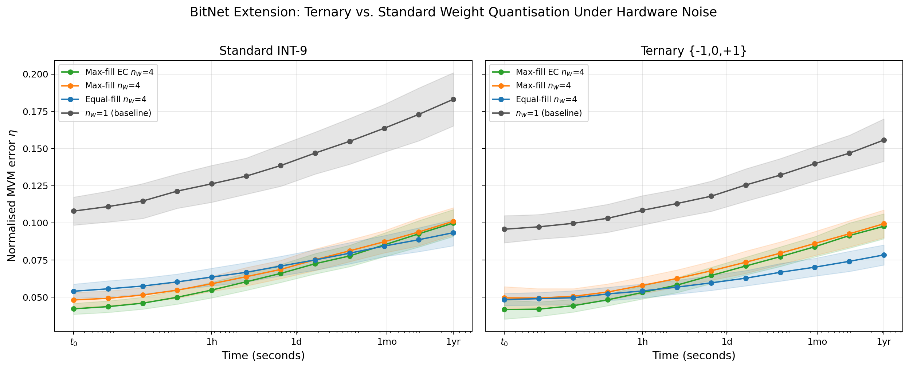

# Multi-Resolution Weight Quantisation & Noise-Robust DNN Inference

<p align="center">
  
  
  
  
</p>

How do you deploy a neural network when your hardware introduces noise at every weight? This repository contains my code for the bit-slicing framework published in [Le Gallo, Ciric et al., *Neuromorphic Computing and Engineering* 2022](https://iopscience.iop.org/article/10.1088/2634-4386/ac4fb7), of which I am co-author. It implements a **complete quantisation-aware inference pipeline** — from custom PyTorch layers with noisy forward / clean backward passes (STE), to Monte Carlo robustness evaluation, to noise-aware training ([Joshi et al. 2020](https://doi.org/10.1038/s41467-020-16108-9)) — applied to **analog in-memory computing** on Phase-Change Memory. I also include an **original extension** evaluating BitNet-style ternary {-1, 0, +1} quantisation on the same hardware simulator.

---

## TL;DR

Deploying DNNs in reduced precision is hard. Quantisation introduces error. Hardware introduces noise. And these errors compound over time. This is true whether you're quantising a Llama model to 4-bit integers for edge deployment, or programming weights into analog memory devices.

My research tackles this problem on **PCM hardware** — where weights are physical conductance values that drift over time — but the core techniques are the same ones used across the LLM deployment stack today:

| What I implemented | Same technique in LLM deployment |
|:-------------------|:---------------------------------|
| **Multi-resolution weight slicing** — split weights across devices at different precisions | **Mixed-precision quantisation** — GPTQ, AWQ, GGUF assign different bit-widths per layer |
| **Noise-aware training (STE)** — inject hardware noise in forward pass, clean gradients in backward | **Quantisation-Aware Training (QAT)** — the standard method for training 4-bit LLMs |
| **Custom analog layers** — `AnalogConv2d` / `AnalogLinear` with noisy forward, straight-through backward | **Fake-quantised layers** — `torch.ao.quantization`, same STE pattern |
| **Error correction across slices** — each slice compensates the actual quantisation error of the previous one | **Residual quantisation** — iterative error correction in vector quantisation (AQLM, QuIP#) |
| **BitNet ternary extension** — weights in {-1, 0, +1}, 1.58 bits/param | **BitNet b1.58** — [Ma et al. 2024](https://arxiv.org/abs/2402.17764), the 1-bit LLM paper |
| **Monte Carlo robustness evaluation** — statistical accuracy guarantees over hardware variability | **Quantisation benchmarking** — evaluating perplexity variance across quantisation configs |
| **Global Drift Compensation** — runtime calibration to correct systematic weight degradation | **Activation calibration** — SmoothQuant, the same idea applied to activation outliers |

**What I built:**
- Complete hardware noise engine (programming noise, conductance drift, 1/f read noise) calibrated to a million-device PCM array
- 5 weight slicing algorithms with different precision/robustness trade-offs
- Monte Carlo MVM error analysis (200–300 trials × 7 configs × 12 time points)
- Full DNN inference pipeline: noise-aware training → analog deployment → accuracy evaluation over time
- Original BitNet extension: ternary vs. INT-9 weights under identical hardware noise

---

## Table of Contents

- [Key Results](#key-results)
- [Engineering Highlights](#engineering-highlights)
- [Challenges & Solutions](#challenges--solutions)
- [The Problem: Quantised Inference on Noisy Hardware](#the-problem-quantised-inference-on-noisy-hardware)
- [The Algorithms](#the-algorithms)
- [Mathematical Formulation](#mathematical-formulation)
- [Technical Decisions](#technical-decisions)
- [Installation & Quick Start](#installation--quick-start)
- [Project Structure](#project-structure)
- [Experimental Validation](#experimental-validation)
- [Original Extension: BitNet on PCM](#original-extension-bitnet-on-pcm)
- [Citation](#citation)

---

## Key Results

### Crossbar-Level Quantisation Error

| Finding | Detail |
|:--------|:-------|
| **Algorithm crossover** | Aggressive quantisation (Max-fill) wins short-term, conservative (Equal-fill) wins under noise accumulation |
| **Optimal base** | Mixed-precision ($b_W = 2$) minimises error fresh; uniform precision ($b_W = 1$) preferred when noise accumulates |
| **Digital vs. analog slicing** | Naïve positional bit extraction wastes dynamic range — adaptive fill strategies are 2–3× better |
| **Theory match** | Simulated errors match analytical prediction (Eq. 8) within ±1σ across all configurations |

### DNN Inference with Noise-Aware Training

| Configuration | Accuracy @ $t_0$ | Accuracy @ 1 month | Accuracy @ 1 year |
|:-------------|:------------------|:--------------------|:-------------------|
| Digital baseline (FP32) | 93.5% | — | — |
| 8 slices, aggressive fill | 92.8% | 91.5% | 90.5% |
| 8 slices, error-corrected | 92.7% | 92.0% | — |
| 8 slices, uniform fill | 92.7% | 91.9% | — |

Key takeaway: **noise-aware training (STE + noise injection) recovers >99% of digital accuracy** even under realistic hardware noise. The error-corrected algorithm achieves the best long-term robustness — analogous to how residual quantisation outperforms naïve round-to-nearest in LLM compression.

### The Optimal Strategy Flips Over Time

<p align="center">
  
</p>

<p align="center"><em>Left: fresh deployment (quantisation noise only) — aggressive fill wins. Right: after 1 month of noise accumulation — conservative fill wins. 9 simulation curves + 2 analytical predictions, all matching within ±1σ.</em></p>

### Error Grows Over Time — Algorithm Choice Determines the Rate

<p align="center">
  
</p>

<p align="center"><em>Left: error correction keeps error low across all slice counts. Right: the crossover between Max-fill and Equal-fill is clearly visible — the optimal deployment strategy depends on inference lifetime.</em></p>

### DNN Inference: Bit Slicing Improves Accuracy and Retention Through Averaging

<p align="center">
  
</p>

<p align="center"><em>Figure 5(a): ResNet-32 on CIFAR-10 with noise-aware training and max-fill (bW=1). More slices → higher accuracy, better retention over time, and reduced variability across hardware instances. Unlike digital bit slicing (which extends dynamic range), analog bit slicing reduces error through averaging within a fixed dynamic range. 100 Monte Carlo inference runs.</em></p>

### The Crossover Confirmed at DNN Level

<p align="center">
  
</p>

<p align="center"><em>Figure 5(c): Five quantisation configurations at t₀ and 1 month. At t₀, max-fill algorithms achieve the best accuracy. After 1 month, equal-fill with bW=1 performs at least equally well — because conductance drift acts as multiplicative noise, making equal-significance averaging (bW=1) optimal over time. The optimal deployment strategy depends on the inference lifetime.</em></p>

### BitNet Extension: Ternary vs. Standard Weights Under Hardware Noise

<p align="center">
  
</p>

<p align="center"><em>Ternary {-1,0,+1} weights (right) start with lower error but the advantage narrows under drift. The quantisation algorithm matters more than bit-width for long-term robustness.</em></p>

### Higher Precision Base Hurts Long-Term Robustness

<p align="center">
  
</p>

<p align="center"><em>Mixed-precision (higher base $b_W$) amplifies MSB noise under drift — uniform precision ($b_W = 1$) is safer for deployment.</em></p>

---

## Engineering Highlights

| Aspect | Implementation |
|:-------|:---------------|
| **Reusable package** | `src/pcm_sim/` — 8 modules with clear single-responsibility separation |
| **Custom PyTorch layers** | `AnalogConv2d` / `AnalogLinear` with stored quantisation state, noisy forward, clean backward (STE) |
| **Dual backends** | NumPy for fast Monte Carlo sweeps, PyTorch for gradient-based training — same physics |
| **Stored quantisation state** | Noise sampled once per "deployment", not per forward pass — physically correct, critical for error correction |
| **Parallel Monte Carlo** | `joblib.Parallel` with seed-based reproducibility, ~2700 independent trials |
| **Validated convergence** | All 7 methods produce identical error at 1 slice (to 6 decimal places) |

```
$ python -c "from pcm_sim.engine import run_trial_4a; ..."
n_W=1 convergence check (all methods identical):
  EqualFill  equal       b=1: η = 0.104624
  MaxFill    equal       b=1: η = 0.104624
  dependent  equal       b=1: η = 0.104624
  MaxFill    positional  b=2: η = 0.104624
  EqualFill  varying     b=2: η = 0.104624
  dependent  varying     b=2: η = 0.104624  ✓
```

---

## Challenges & Solutions

Real debugging stories — every one of these has a direct analogue in quantised LLM deployment:

| Problem | Investigation | Solution |
|:--------|:--------------|:---------|
| **Error correction gave wrong results** | Residual update used *target* value instead of *actual quantised* value | Fixed: `residual -= S_actual * power`. Same bug pattern as using FP weights instead of quantised weights in GPTQ's iterative update |
| **Naïve bit-extraction always worse** | Positional encoding wastes dynamic range for Gaussian weights | Confirmed: adaptive strategies are strictly better. Same reason GPTQ outperforms round-to-nearest — you need to adapt to weight statistics |
| **Errors underestimated at 1 month** | Was re-sampling quantisation noise at each inference instead of storing it | Stored noise once at "deployment". Analogous to the difference between simulating quantisation noise (wrong) and actually quantising weights (right) |
| **Calibration factor exploding** | Division by near-zero in runtime calibration | Added `+ 1e-15` guard, used `sum(abs(...))` for scalar calibration. Same numerical stability issue as SmoothQuant's activation scaling |
| **Mixed-precision slice ordering bug** | LSB-first vs MSB-first confusion across 4 algorithm variants | Standardised internal representation. Added convergence test at 1 slice to catch ordering bugs — same sanity check as verifying that 32-bit and 16-bit inference match at full precision |
| **DNN accuracy collapsed** | Quantisation noise was re-rolled every forward pass | Added `_is_programmed` flag — quantise once, infer many. Same issue as accidentally re-quantising during evaluation |

---

## The Problem: Quantised Inference on Noisy Hardware

### Why This is Hard

The core challenge is universal across all low-precision deployment:

```
                     FP32 weights
                          │
                    ┌─────┴─────┐
                    │ Quantise  │  ← introduces rounding error
                    └─────┬─────┘
                          │
                    ┌─────┴─────┐
                    │  Deploy   │  ← hardware adds noise (PCM drift, DRAM bit flips,
                    └─────┬─────┘    thermal noise, ...)
                          │
                    ┌─────┴─────┐
                    │  Infer    │  ← noise accumulates over time / repeated reads
                    └─────┬─────┘
                          │
                    How much accuracy
                    did we lose?
```

On PCM hardware specifically, three noise sources degrade weights:

1. **Programming noise** — writing a target value gives $G_T + \mathcal{N}(0, \sigma_\text{prog}^2(G_T))$ — analogous to quantisation round-off
2. **Conductance drift** — $G(t) = G_0 \cdot (t/t_0)^{-\nu}$ — weights physically decay over time
3. **1/f read noise** — stochastic read errors that grow logarithmically with time

A single device gives ~4-bit precision. **Bit-slicing** recovers 8–9 bits by splitting each weight across $n_W$ devices — exactly like mixed-precision quantisation splits activations across multiple representations.

### The Trade-Off

$$\eta \propto \frac{1}{\sqrt{n_W}}$$

More slices = more precision = more hardware cost. Our paper asks: can smarter *algorithms* achieve the same precision with fewer resources? (Same question as: can GPTQ achieve 4-bit quality with less calibration data than naïve RTN?)

---

## The Algorithms

Five strategies for splitting weights across quantised representations, from simplest to most sophisticated:

### Equal-Fill (uniform precision)

Each slice stores $w / n_W$. All slices contribute equally:

$$w_\text{recon} = \sum_{j=0}^{n_W - 1} S_j$$

Analogous to **uniform quantisation** (all bits treated equally). Robust to noise but doesn't maximise SNR.

### Max-Fill (aggressive packing)

Fill the most-significant slice to maximum range, assign remainder to lower slices. Maximises SNR short-term but creates unequal noise sensitivity.

Analogous to **non-uniform quantisation** — more precision where it matters most.

### Max-Fill with Error Correction (EC)

The residual for slice $j+1$ accounts for the *actual quantised* value of slice $j$ (not the target):

$$\text{residual}_{j+1} = \text{residual}_j - S_{\text{actual},j} \cdot b_W^{j}$$

This is **residual quantisation** — the same principle behind AQLM and QuIP#. Each step corrects the error of the previous one.

### Digital (Positional) Slicing

Extract physical bit groups from the integer representation. Each slice has significance $2^k$. Conceptually simple but wastes range for Gaussian weights — analogous to naïve round-to-nearest without calibration.

### Ternary (BitNet-style)

Weights quantised to {-1, 0, +1} using threshold $\alpha \cdot \text{mean}(|W|)$. Only 3 levels — minimal precision, potentially maximal noise robustness. Direct implementation of [BitNet b1.58](https://arxiv.org/abs/2402.17764).

---

## Mathematical Formulation

### Analytical Error Prediction (Equation 8)

For uniform slicing with base $b_W$:

$$\eta = \eta_s \cdot \sqrt{\frac{(1 - b_W)(1 + b_W^{n_W})}{(1 + b_W)(1 - b_W^{n_W})}} \quad (b_W > 1)$$

For $b_W = 1$ (equal precision per slice):

$$\eta = \frac{\eta_s}{\sqrt{n_W}}$$

This is calibrated from a single simulation point and predicts all other configurations analytically.

### Straight-Through Estimator (STE)

Forward pass (quantise + noise):

$$w_\text{eff} = \text{Quantise}(w) + \mathcal{N}(0, \sigma^2(w))$$

Backward pass (straight-through):

$$\frac{\partial \mathcal{L}}{\partial w} = \frac{\partial \mathcal{L}}{\partial w_\text{eff}}$$

The same STE used in QAT for LLMs — gradients flow through the quantisation step as if it weren't there.

### Global Drift Compensation (Runtime Calibration)

$$\beta(t) = \frac{\sum_i |y_\text{cal}(t_0)|}{\sum_i |y_\text{cal}(t)|}$$

A calibration vector sent through the network gives a scalar correction factor. Same principle as **activation calibration** in SmoothQuant — use a reference signal to correct systematic bias.

---

## Technical Decisions

### Why Stored Quantisation State

The error correction algorithm only works if each slice knows the *actual* (noisy) value of the previous slice, not the target. This means quantisation noise must be sampled once and stored:

| Method | Verdict | Rationale |
|:-------|:--------|:----------|
| Re-sample noise each forward pass | **Rejected** | Wrong — quantisation is done once at deployment. Also breaks error correction |
| Store quantised weights + noise state | **Adopted** | Correct. Only read noise is stochastic per inference |

This led to the `AnalogMixin._program()` / `._read(t)` architecture — same pattern as `torch.ao.quantization` separating `prepare()` from `convert()`.

### Why Two Physics Backends

| Backend | Use case | Reason |
|:--------|:---------|:-------|
| NumPy | Monte Carlo sweeps (Figures 4a–c) | 5–10× faster, no autograd overhead |
| PyTorch | Noise-aware training (Figure 5) | Need gradients for STE-based training |

Both implement identical physics. Same pattern as having a fast C++ inference engine and a Python training framework.

### Why Convergence Testing at 1 Slice

At $n_W = 1$, all algorithms must produce identical results. Testing this to 6 decimal places catches subtle bugs in slice ordering, residual computation, and base handling. Same principle as verifying that a quantised model at full precision matches the FP32 baseline exactly.

---

## Installation & Quick Start

```bash
git clone https://github.com/lciric/pcm-bitslicing.git
cd pcm-bitslicing
pip install -r requirements.txt
```

### Monte Carlo Analysis (CPU, ~10–30 min each)

```bash
cd scripts
python run_figure_4a.py   # → figures/figure_4a.png
python run_figure_4b.py   # → figures/figure_4b.png
python run_figure_4c.py   # → figures/figure_4c.png
```

### DNN Inference Pipeline (GPU recommended, ~3–4 hours)

```bash
pip install torch torchvision
python scripts/run_figure_5.py   # Noise-aware training + Monte Carlo inference
```

### BitNet Extension

```bash
python scripts/run_bitnet_extension.py   # → figures/bitnet_pcm_extension.png
```

---

## Project Structure

```
pcm-bitslicing/
├── src/pcm_sim/                # Reusable Python package
│   ├── device.py               # Hardware noise model — NumPy
│   ├── device_torch.py         # Hardware noise model — PyTorch
│   ├── slicing.py              # 5 quantisation algorithms
│   ├── engine.py               # Monte Carlo trial functions
│   ├── theory.py               # Analytical error predictions
│   ├── analog_layers.py        # Custom PyTorch layers (STE, stored state)
│   ├── training.py             # Noise-aware training (QAT-style)
│   └── utils.py                # convert_to_analog, eval_mc, evaluate
├── scripts/                    # Standalone reproduction scripts
│   ├── run_figure_4a.py        # Error vs. number of slices
│   ├── run_figure_4b.py        # Error vs. precision base
│   ├── run_figure_4c.py        # Error vs. time
│   ├── run_figure_5.py         # CIFAR-10 noise-aware training + inference
│   └── run_bitnet_extension.py # Ternary vs. standard quantisation
├── notebooks/                  # Interactive versions (~50 lines each)
│   ├── figure_4a.ipynb
│   ├── figure_4b.ipynb
│   ├── figure_4c.ipynb
│   ├── figure_5.ipynb
│   └── bitnet_pcm_extension.ipynb
├── figures/                    # Output PNGs
├── requirements.txt
└── LICENSE
```

---

## Experimental Validation

### Convergence at 1 Slice

All 7 quantisation methods produce identical error when using a single representation — validating the implementation:

```
seed=123, N=64:
  EqualFill  equal   b=1:  η(t0) = 0.104624  η(1mo) = 0.152122
  MaxFill    equal   b=1:  η(t0) = 0.104624  η(1mo) = 0.152122
  dependent  equal   b=1:  η(t0) = 0.104624  η(1mo) = 0.152122
  MaxFill    positional:   η(t0) = 0.104624  η(1mo) = 0.152122
  EqualFill  varying b=2:  η(t0) = 0.104624  η(1mo) = 0.152122
  dependent  varying b=2:  η(t0) = 0.104624  η(1mo) = 0.152122
```

### Strategy Crossover Under Noise

```
Fresh (quantisation noise only):
  Aggressive fill, n=8:     92.81%   ← best fresh
  Uniform fill, n=8:        92.74%
  Error-corrected, n=8:     92.74%

After 1 month of noise accumulation:
  Error-corrected, n=8:     92.00%   ← best after drift
  Uniform fill, n=8:        91.92%
  Aggressive fill, n=8:     91.52%   ← worst after drift

✅ Crossover confirmed: the optimal quantisation strategy depends on deployment lifetime.
```

---

## Original Extension: BitNet on PCM

### Motivation

BitNet b1.58 ([Ma et al., 2024](https://arxiv.org/abs/2402.17764)) quantises LLM weights to {-1, 0, +1} — just 1.58 bits per parameter. On analog hardware, this means only 3 conductance levels instead of 256. The natural question: **does extreme quantisation make models more robust to hardware noise?**

### Approach

Same Monte Carlo pipeline, two weight distributions:
- **Standard**: Gaussian, quantised to INT-9 (256 levels, full conductance range)
- **Ternary**: Threshold quantisation to {-1, 0, +1} (3 levels, minimal range usage)

Both evaluated under identical hardware noise across 4 algorithms and 12 time points.

### Finding

Ternary weights show **lower absolute error fresh** (fewer levels → less quantisation noise) but the **relative advantage disappears under noise accumulation** — drift and read noise affect all conductance levels regardless of how many you use. **The quantisation algorithm matters more than the bit-width for deployment robustness.** This suggests that for LLM deployment on noisy hardware, investing in smarter quantisation (GPTQ, residual methods) yields more than simply reducing precision.

---

## Research Context

### The Bigger Picture

This project sits at the intersection of two trends converging in AI infrastructure:

1. **Model compression for deployment** — quantising LLMs from FP16 to INT4/INT2/ternary for edge and mobile inference (GPTQ, AWQ, BitNet)
2. **Novel compute substrates** — analog accelerators, photonic processors, neuromorphic chips that compute efficiently but imprecisely

Both face the same fundamental challenge: **maintaining model accuracy under reduced-precision, noisy computation**. The techniques in this repo — STE-based noise-aware training, multi-resolution quantisation, error-correcting coding, runtime calibration — are the building blocks for solving this challenge on any substrate.

### Related Work

The noise-aware training pipeline is based on [Joshi et al., *Nature Communications* 2020](https://doi.org/10.1038/s41467-020-16108-9), which demonstrated that injecting realistic hardware noise during training makes models robust to analog imperfections.

I later extended this line of work in a separate project on [Hardware-Aware Training](https://github.com/lciric/aimc-hwa-replication) (Rasch et al., *Nature Electronics* 2023), which covers the full training side of the pipeline — knowledge distillation, noise ramping, CAWS — complementing the deployment and inference focus of this repository.

### Limitations

1. **Gaussian weight assumption**: Real DNN weights have heavier tails — crossbar-level analysis is a first-order approximation
2. **Ideal peripherals**: No ADC/DAC quantisation noise or IR drop
3. **Single crossbar**: Real deployments tile across multiple arrays
4. **CIFAR-10 scale**: Production would evaluate on ImageNet / language benchmarks

---

## Citation

If you use this code, please cite our paper:

```bibtex
@article{legallo2022precision,
  title={Precision of bit slicing with in-memory computing based on 
         analog phase-change memory crossbars},
  author={Le Gallo, Manuel and Ciric, Lazar and Sebastian, Abu 
          and others},
  journal={Neuromorphic Computing and Engineering},
  volume={2},
  number={2},
  pages={024003},
  year={2022},
  publisher={IOP Publishing}
}
```

---

## Author

**Lazar Ciric** — ENS Paris-Saclay

Co-author of the bit-slicing publication. This repository contains my implementation of the simulation framework and an original extension to ternary weight quantisation.

---

## License

MIT License — see [LICENSE](LICENSE) file.
