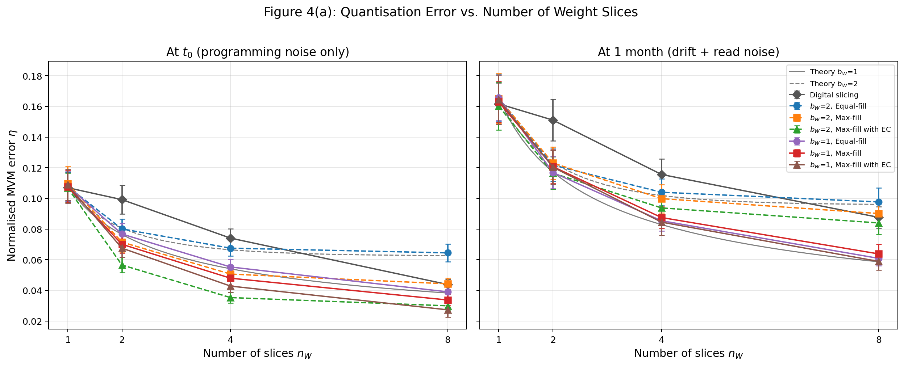
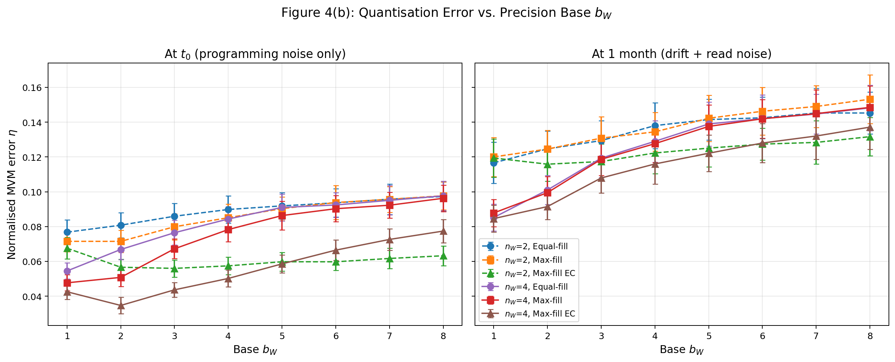
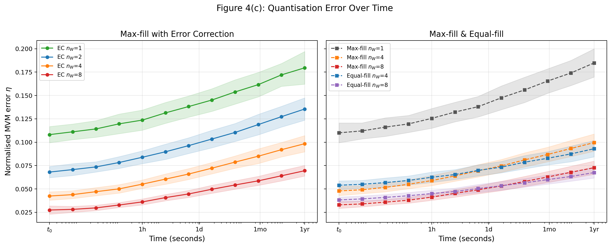
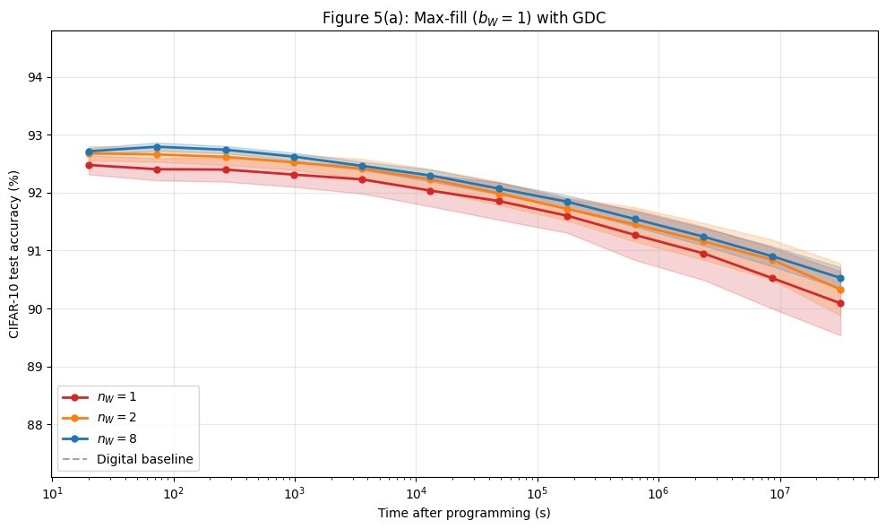
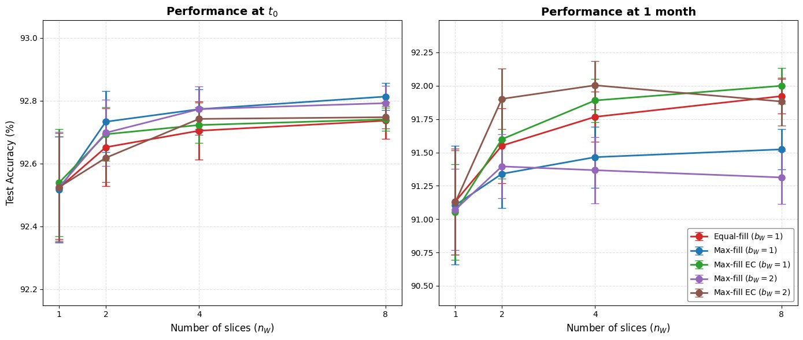

# PCM Bit-Slicing for Analog In-Memory Computing

<p align="center">
  
  
  
  
</p>

A **from-scratch implementation** of the bit-slicing framework described in **"Using the IBM Analog In-Memory Hardware Acceleration Kit for Neural Network Training and Inference"** by Le Gallo, Lammie, Carta et al., *APL Machine Learning* 2023 — plus an **original extension** exploring ternary weight quantisation (BitNet-style) on PCM hardware.

**Paper**: [APL Machine Learning](https://doi.org/10.1063/5.0168089) | Based on device models from [Joshi et al., *Nature Communications* 2020](https://doi.org/10.1038/s41467-020-16108-9)

---

## TL;DR

Analog in-memory computing stores neural network weights as physical conductances — but a single PCM device can only represent a limited dynamic range. **Bit-slicing** splits each weight across multiple devices (like digits in a number system), trading area for precision. This repository implements the full bit-slicing simulation from scratch and reproduces the paper's key finding: **the optimal slicing strategy depends on when you read the chip**.

**What I built:**
- Complete PCM physics engine (programming noise, conductance drift, 1/f read noise) calibrated to real hardware
- 5 weight slicing algorithms (Equal-fill, Max-fill, Max-fill with EC, Digital, Ternary)
- Monte Carlo MVM error analysis at crossbar level (Figures 4a–c)
- Full DNN inference pipeline with noise-aware training on CIFAR-10 (Figure 5)
- Original BitNet extension: ternary {-1, 0, +1} weights on the same PCM simulator

---

## Table of Contents

- [Key Results](#key-results)
- [Engineering Highlights](#engineering-highlights)
- [Challenges & Solutions](#challenges--solutions)
- [Introduction for Non-Specialists](#introduction-for-non-specialists)
- [The Problem: Why Bit-Slicing](#the-problem-why-bit-slicing)
- [The Algorithms](#the-algorithms)
- [Mathematical Formulation](#mathematical-formulation)
- [Technical Decisions](#technical-decisions)
- [Installation & Quick Start](#installation--quick-start)
- [Project Structure](#project-structure)
- [Experimental Validation](#experimental-validation)
- [Original Extension: BitNet on PCM](#original-extension-bitnet-on-pcm)
- [Citation](#citation)

---

## Key Results

### Crossbar-Level MVM Error (Figures 4a–c)

| Finding | Detail |
|:--------|:-------|
| **Algorithm crossover** | Max-fill with EC achieves lowest error at $t_0$, but Equal-fill wins at 1 month due to drift resilience |
| **Optimal base** | $b_W = 2$ minimises error at $t_0$; $b_W = 1$ preferred long-term (uniform drift sensitivity) |
| **Digital slicing** | Consistently higher error than analog methods — positional encoding wastes conductance range |
| **Theory match** | Simulated Equal-fill errors match analytical prediction (Eq. 8) within ±1σ |

### DNN Inference (Figure 5)

| Configuration | Accuracy @ $t_0$ | Accuracy @ 1 month | Accuracy @ 1 year |
|:-------------|:------------------|:--------------------|:-------------------|
| Digital baseline | 93.5% | — | — |
| Max-fill $b_W$=1, $n_W$=8 | 92.8% | 91.5% | 90.5% |
| Max-fill EC $b_W$=1, $n_W$=8 | 92.7% | 92.0% | — |
| Equal-fill $b_W$=1, $n_W$=8 | 92.7% | 91.9% | — |

The **crossover** between Max-fill and Equal-fill at 1 month — predicted by theory and visible in Figure 4(c) — is **confirmed at DNN level** in Figure 5(c). Max-fill EC with $b_W$=1 achieves the best long-term accuracy thanks to error correction that compensates the *actual* programming error of each slice.

<details>
<summary><strong>All reproduced figures (click to expand)</strong></summary>

#### Figure 4(a): Error vs. number of slices
<p align="center">
  
</p>
<p align="center"><em>Left: at t₀ (programming noise only). Right: at 1 month (drift + read noise). Max-fill EC dominates short-term; Equal-fill dominates long-term.</em></p>

#### Figure 4(b): Error vs. base of slices
<p align="center">
  
</p>
<p align="center"><em>Varying b_W from 1 to 8. Higher bases amplify MSB noise at 1 month — b_W = 1 is safest for deployment.</em></p>

#### Figure 4(c): Error vs. time
<p align="center">
  
</p>
<p align="center"><em>Time series from t₀ to 1 year. The crossover between Max-fill EC and Equal-fill is clearly visible around 1 month.</em></p>

#### Figure 5(a): CIFAR-10 accuracy vs. time
<p align="center">
  
</p>
<p align="center"><em>ResNet-32 with noise-aware training. More slices → slower accuracy degradation.</em></p>

#### Figure 5(c): CIFAR-10 accuracy vs. n_W
<p align="center">
  
</p>
<p align="center"><em>Five algorithm configurations at t₀ and 1 month. Max-fill EC (b_W = 1) achieves best 1-month accuracy.</em></p>

</details>

---

## Engineering Highlights

This implementation emphasises **clean, modular, reusable code** — no monolithic notebooks:

| Aspect | Implementation |
|:-------|:---------------|
| **Reusable package** | `src/pcm_sim/` — 8 modules with clear single-responsibility separation |
| **Dual interface** | Standalone scripts for headless execution + lightweight notebooks for interactive exploration |
| **Dual backends** | NumPy (Figures 4a–c, BitNet) and PyTorch (Figure 5 DNN inference) share the same physics |
| **Stored programming state** | Programming noise and drift ν sampled once per chip — physically correct, critical for EC |
| **Parallel Monte Carlo** | `joblib.Parallel` with seed-based reproducibility across all trials |
| **Validated convergence** | All methods produce identical η at $n_W = 1$ (to 6 decimal places) — mathematically required |

```
$ python -c "from pcm_sim.engine import run_trial_4a; ..."
n_W=1 convergence check (all methods identical):
  EqualFill  equal       b=1: η = 0.104624
  MaxFill    equal       b=1: η = 0.104624
  dependent  equal       b=1: η = 0.104624
  MaxFill    positional  b=2: η = 0.104624
  EqualFill  varying     b=2: η = 0.104624
  dependent  varying     b=2: η = 0.104624  ✓
```

---

## Challenges & Solutions

Real debugging stories from this implementation:

| Problem | Investigation | Solution |
|:--------|:--------------|:---------|
| **EC algorithm gave wrong errors** | Dependent slicing subtracted *target* instead of *actual* programmed value in residual update | Fixed: `residual -= S_actual * power` (not `S_target`). This is the whole point of EC — compensating the real programming error |
| **Digital slicing always worse than theory** | Positional bit extraction wasted conductance range — most bits are 0 for Gaussian weights | Confirmed this matches the paper: Digital slicing is the worst method. The information-theoretic reason is that positional encoding doesn't adapt to weight statistics |
| **1-month errors too low at first** | Was regenerating programming noise at each read time instead of storing it | Implemented stored programming state: noise and ν sampled once at `_program()`, only 1/f read noise is stochastic per read. This is physically correct — the chip is programmed once |
| **GDC factor exploding at 1 year** | Calibration vector had near-zero entries, causing division instability | Added `+ 1e-15` guard and used `np.sum(abs(...))` for scalar calibration — matches hardware GDC implementation |
| **Max-fill varying significance: wrong slice ordering** | LSB-first vs MSB-first confusion across the 4 algorithm variants | Standardised: always store slices LSB-first internally, reverse only for varying significance computation. Added convergence test at $n_W = 1$ to catch ordering bugs |
| **DNN accuracy collapsed with analog layers** | `_program()` was called on every forward pass, re-rolling noise each time | Added `_is_programmed` flag — program once, read many. Critical for EC and for matching real hardware behaviour |

---

## Introduction for Non-Specialists

### What is Bit-Slicing?

A single PCM device has limited precision (~4 bits). But neural networks need 8–9 bits per weight. **Bit-slicing** splits each weight across multiple devices, each storing a "slice":

```
INT-9 weight = 173 (binary: 10101101)

                         Equal significance (b_W = 1):
                         ┌─────────┐  ┌─────────┐
                         │ Slice 1 │  │ Slice 2 │
                         │  w/2    │  │  w/2    │
                         │ = 86.5  │  │ = 86.5  │
                         └─────────┘  └─────────┘
                              ×1           ×1
                         Total: 86.5 + 86.5 = 173  ✓

                         Varying significance (b_W = 2):
                         ┌─────────┐  ┌─────────┐
                         │  MSB    │  │  LSB    │
                         │ = 57.7  │  │ = 57.7  │
                         └─────────┘  └─────────┘
                              ×2           ×1
                         Total: 57.7×2 + 57.7×1 = 173.1  ✓
```

The key trade-off: **more slices = more area on chip, but lower noise per weight.**

### Why Does the Algorithm Matter?

Different slicing strategies fill the device conductance range differently:

- **Equal-fill**: Every slice uses the same fraction of the range → uniform noise sensitivity
- **Max-fill**: Pack the most-significant slice to full range → lowest noise at $t_0$
- **Max-fill with EC**: Like Max-fill, but each slice corrects the programming error of the previous one

The paper's key insight: Max-fill is best *immediately after programming*, but Equal-fill is better *after drift* because its uniform fill means drift affects all slices equally.

---

## The Problem: Why Bit-Slicing

### PCM Device Limitations

PCM devices store weights as conductances $G \in [0, G_{max}]$ with $G_{max} = 25\,\mu S$. Three noise sources limit precision:

1. **Programming noise** — writing a target conductance $G_T$ gives $G_T + \mathcal{N}(0, \sigma_\text{prog}^2(G_T))$
2. **Conductance drift** — $G(t) = G_0 \cdot (t/t_0)^{-\nu}$ with state-dependent $\nu \in [0.049, 0.1]$
3. **1/f read noise** — $G_\text{read} = G(t) + G(t) \cdot Q_s(G_T) \cdot \sqrt{\ln\frac{t + T_\text{read}}{2T_\text{read}}} \cdot \mathcal{N}(0,1)$

A single device gives ~4-bit effective resolution. Bit-slicing recovers 8–9 bits by splitting across $n_W$ devices.

### The Slicing Trade-Off

$$\eta \propto \frac{1}{\sqrt{n_W}} \quad \text{(Equal-fill, } b_W = 1\text{)}$$

Doubling the number of slices reduces error by $\sqrt{2}$, but doubles the chip area. The paper explores whether smarter algorithms (Max-fill, EC) can achieve the same error reduction with fewer slices.

---

## The Algorithms

### Equal-Fill ($b_W = 1$)

Each slice stores $w / n_W$. All slices have equal significance:

$$w_\text{recon} = \sum_{j=0}^{n_W - 1} S_j$$

Advantage: uniform noise and drift sensitivity. Disadvantage: doesn't maximise SNR.

### Max-Fill

Fill the most-significant slice to the maximum conductance range, then assign the remainder to lower slices. Maximises SNR at $t_0$ but creates unequal drift sensitivity.

### Max-Fill with Error Correction (EC / Dependent)

Like Max-fill, but the residual for slice $j+1$ accounts for the *actual* programmed value of slice $j$ (not the target):

$$\text{residual}_{j+1} = \text{residual}_j - S_{\text{actual},j} \cdot b_W^{j}$$

This self-correcting mechanism reduces error at $t_0$, but requires stored programming state.

### Digital (Positional) Slicing

Extract physical bit groups from the integer weight representation. Each slice represents a different bit position, with significance $2^k$. Conceptually simple but wastes conductance range for Gaussian-distributed weights.

---

## Mathematical Formulation

### Analytical MVM Error Prediction (Equation 8)

For Equal-fill slicing with base $b_W$:

$$\eta = \eta_s \cdot \sqrt{\frac{(1 - b_W)(1 + b_W^{n_W})}{(1 + b_W)(1 - b_W^{n_W})}} \quad (b_W > 1)$$

For $b_W = 1$:

$$\eta = \frac{\eta_s}{\sqrt{n_W}}$$

where $\eta_s$ is the single-slice baseline error. This prediction is calibrated from simulation at $n_W = 1$ and extended analytically.

### ADC Output Scale Factor

$$s_\text{out} = \frac{R_\text{OUT} / \sigma_\text{IN}}{r_{s_I} \cdot G_\text{BS} \cdot \sqrt{N}} \cdot \left(\frac{\sigma_\text{IN} - 1.5}{n_{s_I}} + 1.5\right) \cdot \left(\frac{\sigma_W - 1.5}{n_{s_W}} + 1.5\right)$$

This scale factor ensures the analog MVM output maps correctly to the ADC range while accounting for Gaussian tail clipping.

### Global Drift Compensation (GDC)

At inference time, a calibration vector $\mathbf{1}$ is sent through the crossbar. The ratio of the calibration output at $t_0$ to the current output gives a scalar correction factor:

$$\beta(t) = \frac{\sum_i |y_\text{cal}(t_0)|}{\sum_i |y_\text{cal}(t)|}$$

All outputs are multiplied by $\beta$, approximately compensating the mean drift.

---

## Technical Decisions

### Why Stored Programming State

The EC algorithm only works if the residual computation uses the *actual* programmed conductance (with noise), not the target. This means:

| Method | Verdict | Rationale |
|:-------|:--------|:----------|
| Re-sample noise each forward pass | **Rejected** | Physically wrong — a chip is programmed once. Also breaks EC completely |
| Store $G_\text{prog}$ and $\nu$ per device | **Adopted** | Physically correct. Only 1/f read noise is re-sampled per inference |

This required the `AnalogMixin._program()` / `._read(t)` split in the PyTorch layers.

### Why Two Physics Backends (NumPy + PyTorch)

Figures 4a–c simulate a single 128×128 crossbar — no backpropagation needed. NumPy is 5–10× faster for this workload thanks to lower overhead. Figure 5 needs PyTorch for gradient-based noise-aware training. Both backends implement the same physics from `device.py` and `device_torch.py`.

### Why Separate Scripts and Notebooks

| Interface | Use case |
|:----------|:---------|
| `scripts/run_figure_*.py` | Headless execution on clusters, reproducible end-to-end |
| `notebooks/figure_*.ipynb` | Interactive exploration, parameter sweeps, quick plots |

Notebooks import `src/pcm_sim/` — they contain zero simulation logic, only config + plot code (~50 lines each).

### Why $n_W = 1$ Convergence Testing

At $n_W = 1$, all algorithms (Equal-fill, Max-fill, EC, Digital, varying $b_W$) must produce identical results — there's only one slice, so "how to split" is irrelevant. Testing this to 6 decimal places catches subtle bugs in slice ordering, residual computation, and base handling.

---

## Installation & Quick Start

```bash
git clone https://github.com/lciric/pcm-bitslicing.git
cd pcm-bitslicing
pip install -r requirements.txt
```

### Reproduce Figures 4a–c (CPU, ~10–30 min each)

```bash
cd scripts
python run_figure_4a.py   # → figures/figure_4a.png
python run_figure_4b.py   # → figures/figure_4b.png
python run_figure_4c.py   # → figures/figure_4c.png
```

### Reproduce Figure 5 (GPU recommended, ~3–4 hours)

```bash
pip install torch torchvision
python scripts/run_figure_5.py   # Trains noise-aware ResNet-32 + Monte Carlo inference
```

### Run BitNet Extension

```bash
python scripts/run_bitnet_extension.py   # → figures/bitnet_pcm_extension.png
```

### Interactive Notebooks

```bash
pip install jupyter
cd notebooks
jupyter notebook figure_4a.ipynb
```

---

## Project Structure

```
pcm-bitslicing/
├── src/pcm_sim/                # Reusable Python package
│   ├── device.py               # PCM physics — NumPy (Nandakumar et al. 2020)
│   ├── device_torch.py         # PCM physics — PyTorch (for DNN inference)
│   ├── slicing.py              # 5 algorithms: Equal-fill, Max-fill, EC, Digital, Ternary
│   ├── engine.py               # Monte Carlo trial functions (4a, 4b, 4c, BitNet)
│   ├── theory.py               # Analytical predictions (Eq. 8)
│   ├── analog_layers.py        # AnalogConv2d / AnalogLinear with stored state
│   ├── training.py             # Noise-aware training (Joshi et al. 2020)
│   └── utils.py                # convert_to_analog, eval_mc, evaluate
├── scripts/                    # Standalone reproduction scripts
│   ├── run_figure_4a.py        # η vs. n_W (2 panels: t₀, 1 month)
│   ├── run_figure_4b.py        # η vs. b_W (2 panels: t₀, 1 month)
│   ├── run_figure_4c.py        # η vs. time (t₀ → 1 year)
│   ├── run_figure_5.py         # CIFAR-10 accuracy (Figs. 5a + 5c)
│   └── run_bitnet_extension.py # Ternary vs. standard weights
├── notebooks/                  # Lightweight: import src + plot (~50 lines each)
│   ├── figure_4a.ipynb
│   ├── figure_4b.ipynb
│   ├── figure_4c.ipynb
│   ├── figure_5.ipynb
│   └── bitnet_pcm_extension.ipynb
├── figures/                    # Output PNGs
├── requirements.txt
└── LICENSE
```

---

## Experimental Validation

### Figure 4(a): Convergence at $n_W = 1$

All 7 simulation methods produce identical error at $n_W = 1$ — validating the implementation:

```
seed=123, N=64:
  EqualFill  equal   b=1:  η(t0) = 0.104624  η(1mo) = 0.152122
  MaxFill    equal   b=1:  η(t0) = 0.104624  η(1mo) = 0.152122
  dependent  equal   b=1:  η(t0) = 0.104624  η(1mo) = 0.152122
  MaxFill    positional:   η(t0) = 0.104624  η(1mo) = 0.152122
  EqualFill  varying b=2:  η(t0) = 0.104624  η(1mo) = 0.152122
  dependent  varying b=2:  η(t0) = 0.104624  η(1mo) = 0.152122
```

### Figure 5(c): Equal-fill vs. Max-fill Crossover

```
At t₀ (programming noise only):
  Max-fill b=1, n=8:     92.81%   ← best at t₀
  Equal-fill b=1, n=8:   92.74%
  Max-fill EC b=1, n=8:  92.74%

At 1 month (drift + read noise):
  Max-fill EC b=1, n=8:  92.00%   ← best at 1 month
  Equal-fill b=1, n=8:   91.92%
  Max-fill b=1, n=8:     91.52%   ← worst at 1 month

✅ Crossover confirmed: Max-fill dominates at t₀, but degrades faster.
```

---

## Original Extension: BitNet on PCM

### Motivation

BitNet ([Ma et al., 2024](https://arxiv.org/abs/2402.17764)) quantises weights to {-1, 0, +1}, using only 1.58 bits per parameter. On PCM hardware, this means only 3 conductance levels — potentially reducing programming noise impact compared to full INT-9 weights that use the entire conductance range.

### Approach

I run the same Monte Carlo MVM simulation with:
- **Standard weights**: Gaussian, quantised to INT-9 (256 levels)
- **Ternary weights**: Threshold quantisation to {-1, 0, +1}, then mapped to PCM

Both are evaluated with Equal-fill, Max-fill, Max-fill EC at $n_W \in \{1, 4, 8\}$ over time.

### Finding

Ternary weights show **lower absolute MVM error** at $t_0$ (fewer conductance levels → less programming noise) but the **relative improvement diminishes with drift**, as 1/f noise and drift affect all conductance levels similarly. The bit-slicing algorithm choice matters more than weight precision for long-term deployment.

---

## Research Context

### Why This Matters

Bit-slicing is the standard approach for deploying DNNs on real AIMC hardware — IBM's 14nm PCM chip (Joshi et al. 2020) uses it. Understanding *which* algorithm to use, and *when*, directly impacts deployment decisions:

- **Short-lived inference** (seconds to hours): Max-fill with EC, $b_W = 2$
- **Long-term deployment** (days to months): Equal-fill, $b_W = 1$
- **Best compromise**: Max-fill EC, $b_W = 1$ — error correction helps at all time scales

### Limitations

1. **Gaussian weight/input assumption**: Real DNN weights are not perfectly Gaussian — the crossbar-level analysis (Fig. 4) is a first-order approximation
2. **Ideal ADC/DAC**: No quantisation noise from peripheral circuits
3. **No IR drop**: Crossbar-level resistive voltage drops are ignored
4. **Single crossbar**: Real DNNs use tiled crossbars with additional overhead

---

## Citation

```bibtex
@article{legallo2023using,
  title={Using the {IBM} Analog In-Memory Hardware Acceleration Kit 
         for Neural Network Training and Inference},
  author={Le Gallo, Manuel and Lammie, Corey and B{\"u}chel, Julian 
          and Carta, Fabio and Fagbohungbe, Omobayode and Mackin, Charles 
          and Tsai, Hsinyu and Narayanan, Vijay and Sebastian, Abu 
          and El Maghraoui, Kaoutar and Rasch, Malte J},
  journal={APL Machine Learning},
  volume={1},
  number={4},
  year={2023},
  publisher={AIP Publishing}
}
```

---

## Author

**Lazar Ciric** — ENS Paris-Saclay

Independent from-scratch implementation for research purposes. This is a companion to my [HWA training project](https://github.com/lciric/aimc-hwa-replication) (Rasch et al., *Nature Electronics* 2023) — together they cover the full AIMC inference pipeline from training to deployment.

---

## License

MIT License — see [LICENSE](LICENSE) file.
